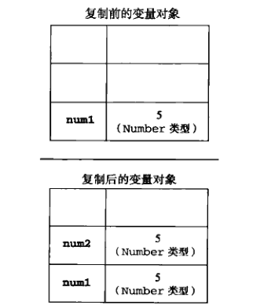
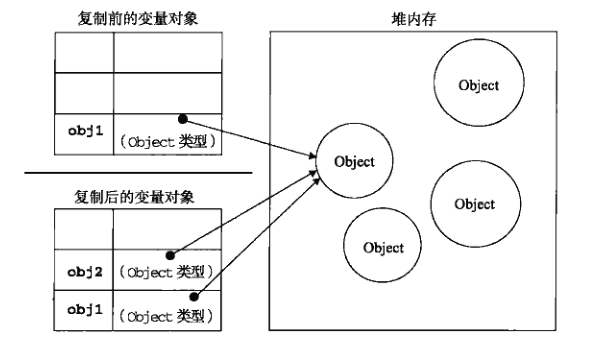

## 基本类型和引用类型

深拷贝和浅拷贝首先是因为`JavaScript`中两种数据类型不同

* 基本数据类型：按值访问，保存在栈内存中，可以对其操作，基本数据类型包含5种：`Undefined`,`Null`,`Boolean`,`Number`,`String`

* 引用数据类型： 按引用访问，保存在堆内存中，同时在栈内存会有一个引用指针指向堆内存中的对象，变量保存的实际是一个指针，在操作对象时实际上是操作的对象的引用指针而不是对象。

基本数据类型复制两者相互独立，不会影响
	
	var num1 = 5;
	var num2 = num1;

引用类型数据类型复制，实际上只是指针的操作，指向不变

	var obj1 = {a: 1};
	var obj2 = obj1;
	obj2.a = 2;
	console.log(obj1.a); // 2

 

由此可见，基本数据类型的复制非常简单，直接使用赋值运算即可.引用类型的复制则不能直接使用赋值运算，否则操作的仍是同一个对象.

## 浅拷贝
