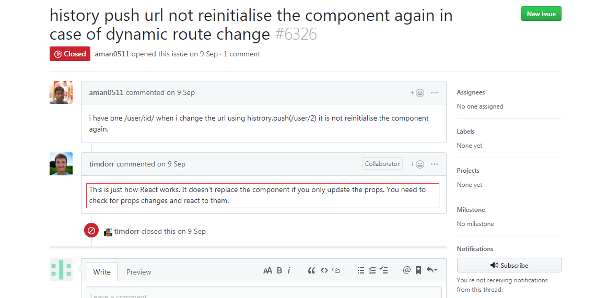

## React路由的跳转的方法

### React-Router 2.0.0 版本

    import { browserHistory } from 'react-router'
    browserHistory.push('/path')

### React-Router 2.4.0版本以上

`React-Router 2.4.0`版本以上，可以通过`mixin`的方法，使组件增加`this.router`属性，然后进行相应的操作，具体`mixin`代码参考如下:

    import { withRouter } from 'react-router';
    clsss ABC extends Component {
    }
    module.exports = withRouter(ABC);

用过`mixin`的组件，会具有`this.router`的属性，只需要使用`this.props.router.push('/path') `就可以跳转到相应的路由

### React-Router 3.0.0版本以上

`3.0.0`版本以后不需要再手动`mixin`相关的`router`属性，在任何需要跳转的组件中写`this.props.router.push('/path') `就可以跳转到响应的路由了。

### React-Router 4.0版本以上

`React-Router 4.0`对路由进行了改进，`router`属性改为了`history`属性，使用方法还是和`3.0`差不多，任何需要跳转的地方使用`this.props.history.push('/path') `就可以进行跳转了

### 参数的获取

使用`this.props.match.params.xxx `可以获取到当前路由的参数

### React子组件调用 this.props.history.push()发生报错的解决方案

父组件代码

    render() {
        return (
        

            <ChildComponent  history ={this.props.history}  />
        

    )

#### this.props.history.push('/path') 无响应bug

此问题使用与url地址为 /xxx/xxx/:id id之间变化，页面无响应, 此时组件进行更新 shoudComponent函数会进行props与nextProps比较，当发现props没有更新数据无响应。
请看react-router-dom 里issue里开发者解答，如图:

解决办法：

    //在事件函数内
    this.props.history.push(`/record/hospital/${res.data.admissionId}`);

    //周期函数内
    shouldComponentUpdate(nextProps) {
        let oOpts = JSON.stringify(this.props.match.params);
        let nOpts = JSON.stringify(nextProps.match.params);
        if(oOpts != nOpts) {
            this.goFetch(nextProps.match.params.id); //dispatch请求, 会更新props
        }
        return true //此处为true, 未考虑到优化性能,仅解决路由push无响应问题
    }

#### `withRouter`高阶组件，提供了`history`让你使用~

    import React from "react";
    import {withRouter} from "react-router-dom";

    class MyComponent extends React.Component {
    ...
    myFunction() {
        this.props.history.push("/some/Path");
    }
    ...
    }
    export default withRouter(MyComponent);
    

这是官方推荐做法哦。但是这种方法用起来有点难受，比如我们想在`redux`里面使用路由的时候，我们只能在组件把`history`传递过去。。

就像问题章节的代码那种场景使用，我们就必须从组件中传一个`history`参数过去。。。

#### 自己创建`history`

我们可以不使用推荐的`BrowserRouter`，依旧使用`Router`组件。我们自己创建`history`，其他地方调用自己创建的`history`。

    // src/history.js

    import createHistory from 'history/createBrowserHistory';

    export default createHistory();

使用Router组件

    // src/index.js

    import { Router, Link, Route } from 'react-router-dom';
    import history from './history';

    ReactDOM.render(
    <Provider store={store}>
        <Router history={history}>
        ...
        </Router>
    </Provider>,
    document.getElementById('root'),
    );

其他地方我们就可以这样用了

    import history from './history';

    export function addProduct(props) {
    return dispatch =>
        axios.post(`xxx`, props, config)
        .then(response => {
            history.push('/cart'); //这里
        });
    }

#### 非要用BrowserRouter

`react-router v4`推荐使用`BrowserRouter`组件，而在第三个解决方案中，我们抛弃了这个组件，又回退使用了`Router`组件。

你去看看`BrowserRouter`的源码，我觉得你就豁然开朗了。