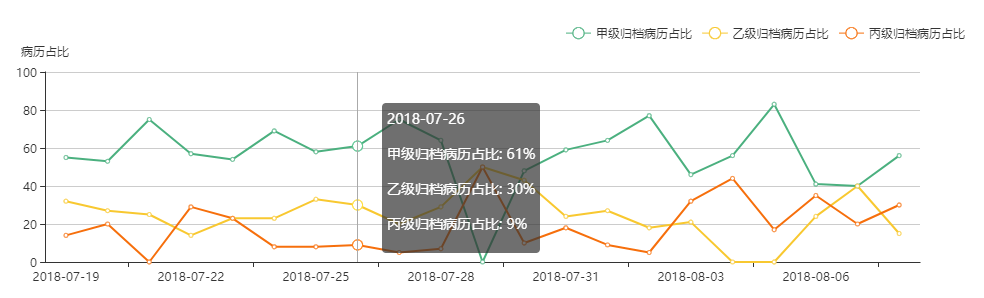
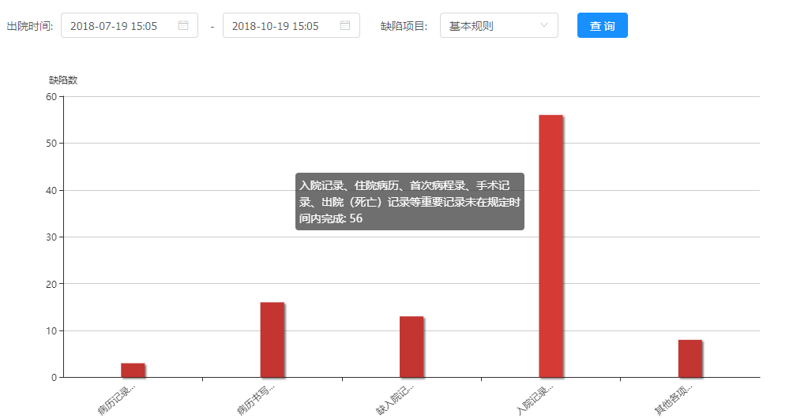
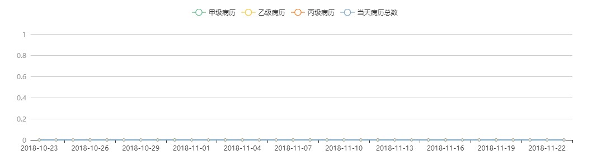

## css让文字在一行内显示

里面的文字不换行显示，超出部分不隐藏

    p {
        width:100px;
        word-break:keep-all;
        white-space:nowrap;     
    }

里面的文字不换行，超出部分用省略号代替

    p {
        width:100px;
        word-break:keep-all;
        white-space:nowrap;
        overflow:hidden;
        text-overflow:ellipsis; 
    }

    white-space: normal; //默认换行

## Echarts 图表显示问题

### 实现鼠标hover上去显示全部信息，需配置tootip的formatter函数

    tooltip: {
        show: true,
        trigger: 'axis',
        //formatter: '{a}({b}): {c}%'
        formatter: function (params) {
            var res='

'+params[0].name+'

';
            for(var i = 0; i < params.length; i++) {
                res += '
'+params[i].seriesName+': '+params[i].data+'%
';
            }
            return res;
        }
    }

### 实现鼠标hover上去显示信息过长时换行

options配置如下:

    getChartsOptionsForLine = () => {
        let {detailData}=this.props;
        let nameArr=detailData.map(e=>e.name);

        let format=(e)=>{
            return e.substr(0,4)+'...'
        }
        return {
            xAxis: {
                axisLabel: {
                    interval: 0,
                    rotate: 40,
                    formatter:format
                },
                data: nameArr
            },
            yAxis: {
                axisLine: {
                    show: true
                },
                name : '缺陷数',
            },
            tooltip: {
                show: true,
                //formatter: '{b}: {c}',
                formatter: function (params) {
                    var res='
' + params.name + ': ' + params.value + '
';
                    return res; //换行显示
                }
            },
            series: [
                {
                    type: 'bar',
                    data: detailData,
                    barWidth: 30,
                    itemStyle: {
                        shadowBlur: 2,
                        shadowColor: 'rgba(0, 0, 0, 0.5)',
                        shadowOffsetX: 2,
                        shadowOffsetY: 2
                    }
                }
            ]
        }
    }

### Echarts 实现无Y轴页, 设置Y轴属性

    yAxis: {
        axisLine: {
            show: false
        },
        axisTick: {
            show: false
        },
        axisLabel: {
            textStyle: {
                color: '#999'
            }
        }
    }

## box-shadow 阴影使用

`box-shadow: h-shadow v-shadow blur spread color inset;`

    h-shadow	//必需的。水平阴影的位置。允许负值
    v-shadow	//必需的。垂直阴影的位置。允许负值
    blur	//可选。模糊距离
    spread	//可选。阴影的大小
    color	//可选。阴影的颜色。在CSS颜色值寻找颜色值的完整列表
    inset	//可选。从外层的阴影（开始时）改变阴影内侧阴影

    