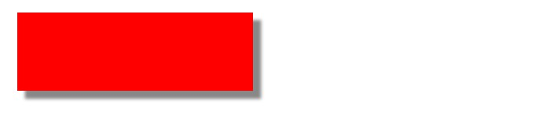
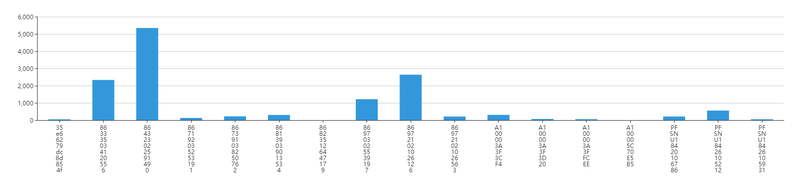

## css让文字在一行内显示

里面的文字不换行显示，超出部分不隐藏

    p {
        width:100px;
        word-break:keep-all;
        white-space:nowrap;     
    }

里面的文字不换行，超出部分用省略号代替

    p {
        width:100px;
        word-break:keep-all;
        white-space:nowrap;
        overflow:hidden;
        text-overflow:ellipsis; 
    }

    white-space: normal; //默认换行

## Echarts 图表显示问题

### 实现鼠标hover上去显示全部信息，需配置tootip的formatter函数

    tooltip: {
        show: true,
        trigger: 'axis',
        //formatter: '{a}({b}): {c}%'
        formatter: function (params) {
            var res='

'+params[0].name+'

';
            for(var i = 0; i < params.length; i++) {
                res += '
'+params[i].seriesName+': '+params[i].data+'%
';
            }
            return res;
        }
    }

### 实现鼠标hover上去显示信息过长时换行

options配置如下:

    getChartsOptionsForLine = () => {
        let {detailData}=this.props;
        let nameArr=detailData.map(e=>e.name);

        let format=(e)=>{
            return e.substr(0,4)+'...'
        }
        return {
            xAxis: {
                axisLabel: {
                    interval: 0,
                    rotate: 40,
                    formatter:format
                },
                data: nameArr
            },
            yAxis: {
                axisLine: {
                    show: true
                },
                name : '缺陷数',
            },
            tooltip: {
                show: true,
                //formatter: '{b}: {c}',
                formatter: function (params) {
                    var res='
' + params.name + ': ' + params.value + '
';
                    return res; //换行显示
                }
            },
            series: [
                {
                    type: 'bar',
                    data: detailData,
                    barWidth: 30,
                    itemStyle: {
                        shadowBlur: 2,
                        shadowColor: 'rgba(0, 0, 0, 0.5)',
                        shadowOffsetX: 2,
                        shadowOffsetY: 2
                    }
                }
            ]
        }
    }

### Echarts 实现无Y轴页, 设置Y轴属性

    yAxis: {
        axisLine: {
            show: false
        },
        axisTick: {
            show: false
        },
        axisLabel: {
            textStyle: {
                color: '#999'
            }
        }
    }

## box-shadow 阴影使用

`box-shadow: h-shadow v-shadow blur spread color inset;`

    h-shadow	//必需的。水平阴影的位置。允许负值
    v-shadow	//必需的。垂直阴影的位置。允许负值
    blur	//可选。模糊距离
    spread	//可选。阴影的大小
    color	//可选。阴影的颜色。在CSS颜色值寻找颜色值的完整列表
    inset	//可选。从外层的阴影（开始时）改变阴影内侧阴影

    

## 解决echarts一个页面展示多个图形时无法自适应

通常，当页面只有一个echarts图形时，可以通过以下代码实现自适应：

    myChart.setOption(option);
    // 设置自适应屏幕大小
    window.onresize = myChart.resize;

但是，当一个页面有多个图时，上述代码可能只会使一个图形自适应，而其他图形不会自适应，这时，在每个echarts图形的代码中都用下面的代码就可以轻松解决：

    myChart.setOption(option);
    // 设置自适应屏幕大小
    //window.onresize = myChart.resize;
    window.addEventListener("resize",function(){
        myChart.resize();
    });

## echarts x轴文字显示不全(xAxis文字倾斜比较全面的3种做法值得推荐)

### 办法1：xAxis.axisLabel 属性

axisLabel的类型是object ,主要作用是：坐标轴刻度标签的相关设置。（当然yAxis也是一样有这个属性的）

    xAxis : [
        {
            type : 'category',
            data : opt.x,
            axisTick: {
                alignWithLabel: true
            },
            axisLabel: {
                interval: 0,
                rotate: 40   //旋转40度
            }
        }
    ],
    grid: {
      left: '3%',
      right: '4%',
      bottom: '5%', //底部预留位置
      containLabel: true
    },

rotate标签倾斜的角度，在类目轴的类目标签显示不全时可以通过旋转防止标签重叠（官方这样说的）旋转的角度是-90到90度
问题又来了，这个名称x轴的文字如果太长会受到遮挡，还是显示不全，这个时候可以用`grid`属性解决

### 办法2：调用formatter文字竖直显示

办法1在一定程度上还是解决了一些问题。在文字不是非常多的情况下还是可以的，axisLabel中使用formatter回调，formatter有两个参数，使用方法是这样的formatter:function(value,index){} ，value是类目（测试医院A，人民医院）,index 是类目索引。

            axisLabel: {
                interval: 0,
                formatter:function(value)
                    {
                        return value.split("").join("\n");
                    }
            }

### 办法3：调用formatter两个字的竖直显示

文字竖直这个formatter实在有点太简单化了，所以我们来做一个两个字的加\n的换行。formatter如下：

       axisLabel: {
            interval: 0,
            formatter:function(value)
            {
                debugger
                var ret = "";//拼接加\n返回的类目项
                var maxLength = 2;//每项显示文字个数
                var valLength = value.length;//X轴类目项的文字个数
                var rowN = Math.ceil(valLength / maxLength); //类目项需要换行的行数
                if (rowN > 1)//如果类目项的文字大于3,
                {
                    for (var i = 0; i < rowN; i++) {
                        var temp = "";//每次截取的字符串
                        var start = i * maxLength;//开始截取的位置
                        var end = start + maxLength;//结束截取的位置
                        //这里也可以加一个是否是最后一行的判断，但是不加也没有影响，那就不加吧
                        temp = value.substring(start, end) + "\n";
                        ret += temp; //凭借最终的字符串
                    }
                    return ret;
                }
                else {
                    return value;
                }
            }
        }

