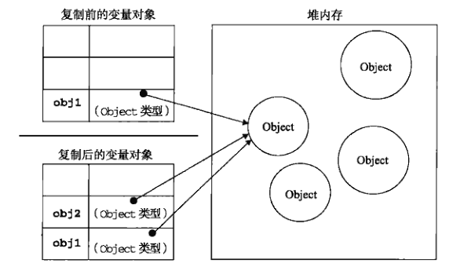

## 基本类型和引用类型

深拷贝和浅拷贝首先是因为`JavaScript`中两种数据类型不同

* 基本数据类型：按值访问，保存在栈内存中，可以对其操作，基本数据类型包含5种：`Undefined`,`Null`,`Boolean`,`Number`,`String`

* 引用数据类型： 按引用访问，保存在堆内存中，同时在栈内存会有一个引用指针指向堆内存中的对象，变量保存的实际是一个指针，在操作对象时实际上是操作的对象的引用指针而不是对象。

基本数据类型复制两者相互独立，不会影响
	
	var num1 = 5;
	var num2 = num1;

引用类型数据类型复制，实际上只是指针的操作，指向不变

	var obj1 = {a: 1};
	var obj2 = obj1;
	obj2.a = 2;
	console.log(obj1.a); // 2

 

由此可见，基本数据类型的复制非常简单，直接使用赋值运算即可.引用类型的复制则不能直接使用赋值运算，否则操作的仍是同一个对象.

## 浅拷贝

	function shallowCopy (obj) {
	  if (typeof obj !== 'object') return obj; //只拷贝引用类型，基本数据类型直接返回即可
	
	  var newObj = obj instanceof Array ? [] : {}; //根据 obj 的类型来判断新建一个空数组或者空对象
	
	  for (var key in obj) {
	    if (obj.hasOwnProperty(key)) {   //使用 hasOwnProperty() 过滤出对象实例的属性
	      newObj[key] = obj[key];
	    }
	  }
	
	  return newObj;
	}

当属性值为基本数据类型时，我们拷贝出来的新对象和原对象互不影响，当属性值为引用类型时，新对象和原对象在修改引用类型的属性值时相互影响。

## 深拷贝

对浅拷贝进行递归调用就是深拷贝

	function deepCopy (obj) {
		if ( typeof obj !== 'object' ) return obj;
	
		var newObj = obj instanceof Array ? [] : {};
	
		for ( var key in obj ) {
			if ( obj.hasOwnProperty( key ) ) {
				newObj[key] = typeof obj[key] === 'object' ? deepCopy( obj[key] ) : obj[key];
			}
		}
	
		return newObj;
	}