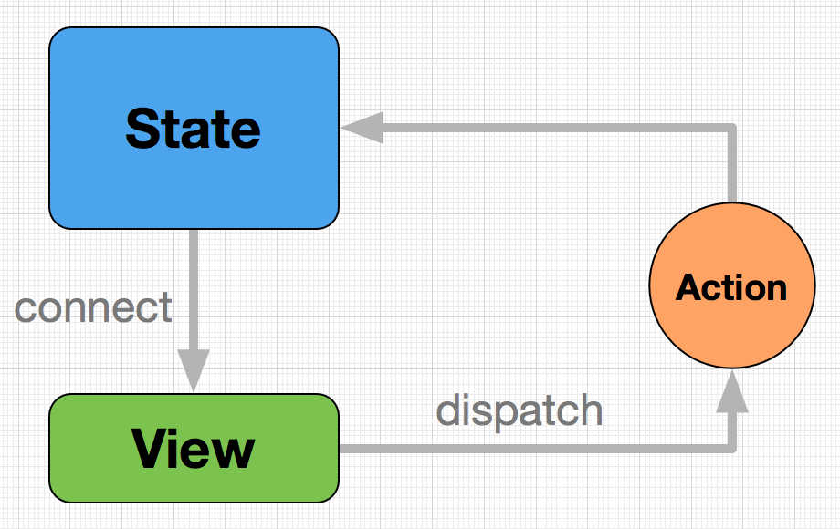

## dva 是什么

`dva` 是体验技术部开发的 React 应用框架，将上面三个 `React` 工具库包装在一起，简化了 `API`，让开发 `React` 应用更加方便和快捷。

dva = React-Router + Redux + Redux-saga

## dva应用最简结构

    import dva from 'dva'

    const Hello = () => 
hello dva
;

    //创建应用
    const app = dva();
    //注册视图
    app.router(() => <Hello/>);
    //启动应用
    app.start('#app');

## 数据流图

 

 ## 核心概念

`State`：一个对象，保存整个应用状态
`View`：React 组件构成的视图层
`Action`：一个对象，描述事件
`connect` 方法：一个函数，绑定 `State` 到 `View`
`dispatch` 方法：一个函数，发送 `Action` 到 `State`

## State和View

`State` 是储存数据的地方，收到 Action 以后，会更新数据。
`View` 就是 React 组件构成的 `UI` 层，从 `State` 取数据后，渲染成 `HTML` 代码。只要 `State` `有变化，View` 就会自动更新。

##  Action

`Action` 是用来描述 `UI` 层事件的一个对象。

    {
        type: 'add',
        value: {
            name,
            content
        }
    }

## connect 方法

`connect`是一个函数，绑定`state`到`view`

    import { connect } from 'dva';

    function mapStateToProps(state) {
        return {
            add: state.add
        }
    }

    connect(mapStateToProps)(Hello)  // Hello:组件

`connect` 方法返回的也是一个 `React` 组件，通常称为容器组件。因为它是原始 `UI` 组件的容器，即在外面包了一层 `State。`

`connect` 方法传入的第一个参数是 `mapStateToProps` `函数，mapStateToProps` 函数会返回一个对象，用于建立 `State` 到 `Props` 的映射关系。

## dispatch 方法

`dispatch` 是一个函数方法，用来将 `Action` 发送给 `State。`

    dispatch({
        type: 'add',
        value: {
            name,
            content
        }
    })

`dispatch` 方法从哪里来？被 `connect` 的 `Component` 会自动在 `props` 中拥有 `dispatch` 方法。

## Model对象的例子

    {
        namespace: 'add',
        state: 0,
        reducers: {
            add(state) { return state + 1 },
        },
        effects: {
            *addSource(action, { call, put }) {
            yield call(delay, 500);
            yield put({ type: 'add' });
            },
        },
    }

## Model 对象的属性

`namespace`: 当前 `Model` 的名称。整个应用的 `State，由多个小的` `Model` 的 `State` 以 `namespace` 为 `key` 合成
`state`: 该 Model 当前的状态。数据保存在这里，直接决定了视图层的输出
`reducers`: Action 处理器，处理同步动作，用来算出最新的 State
`effects：Action` 处理器，处理异步动作

## Reducer

`Reducer` 是 `Action` 处理器，用来处理同步操作，可以看做是 `state` 的计算器。它的作用是根据 `Action，从上一个` `State` 算出当前 `State。`

## Effect

`Action` 处理器，处理异步动作，基于 `Redux-saga` 实现。`Effect` 指的是副作用。根据函数式编程，计算以外的操作都属于 `Effect`，典型的就是 `I/O` 操作、数据库读写。

## call 和 put

`dva` 提供多个 `effect` 函数内部的处理函数，比较常用的是 `call` 和 `put。`

`call`：执行异步函数
`put`：发出一个 `Action`，类似于 `dispatch`

## 参考文献

[DvaJS](https://dvajs.com/)
