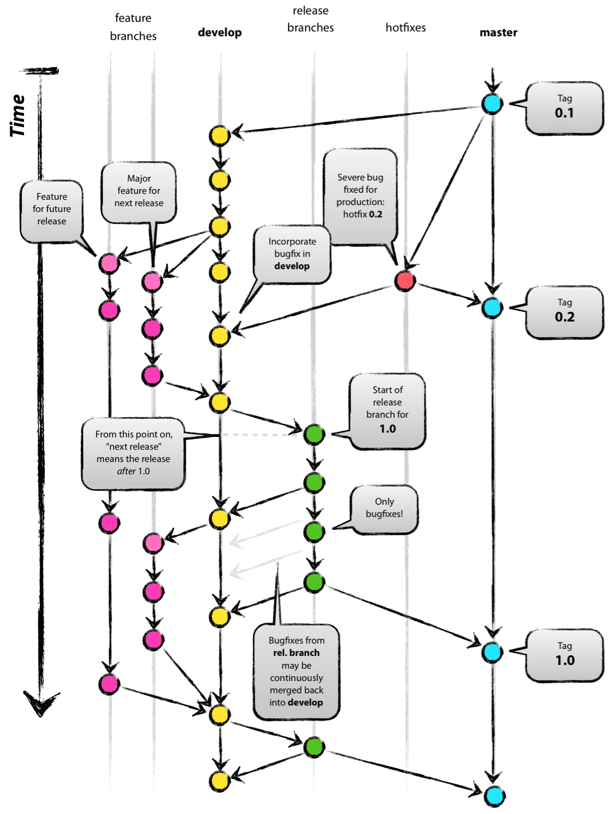

## 切换分支报错
当在其他分支，如`test`分支开发的时候，新增了文件夹等目录结构。开发完成后，切换会`master`分支。

如果出现`“Deletion of directory '***' failed. Should I try again? (y/n)”`，此时，记得选择`n`。

不然，如果选择了y，则`git`就会强制删除不属于`master`分支的文件以及文件夹。有可能删除失败。

不过，不用紧张。毕竟提示被删除的代码，都是工作区的代码，还是可以从本地仓库或远程仓库来恢复代码的。

	rm -f ./.git/index.lock //可用如下命令，来删除index.lock文件。

	ls -l .git //删除之前，可通过如下命令，来查看.git内的文件

删除之后，可通过如上命令，看到`.git`内就没有`index.lock`文件了。同时，也可以正常切换分支等操作了。

此时，再切换到test分支，本属于该分支下的代码，就会都被删除！
## git中文乱码

在Linux提交文件名是中文，使用`git status`或者 `git commit`时候会把中文显示为一串数字：

	git config --global core.quotepath false // 解决办法一

	或手动更改git配置文件 ~/.gitconfig：
	[core]
		quotepath = false

## 修改commit信息

	git commit --amend -m "your message" //修改最近一次commit信息，且这次commit尚未push到远程，可以通过参数--amend直接修改

## git 工作流程
	
	git pull <url> //拉取代码

	git add . //暂存

	git commit -m "" //提交本地仓库

	git push //推送到远程

## 版本管理流程模型

## 应用场景说明

* 在正常开发状态（非版本发布状态）下， 代码库将仅存在两个分支 `master` 分支 和 `develop` 分支，开发人员将相关任务的 `commit` 提交至 `develop` 分支，每个 `commit` 提交需要在提交注释中附加相关修改说明以及JIRA中对应项目下相关的任务编号如"AAA-001"。

* 在版本测试发布状态（sprint开发结束需要测试发布新的版本）下， 代码库将存在 `develop` 分支， `master` 分支以及 `release` 分支。其中 `release` 分支由 `develop` 分支代码派生，由将供测试人员部署在不同的测试环境进行测试，在测试中发现的缺陷，开发人员需在 `release` 分支中进行修复并合并回 `develop` 分支。

* 在版本发布上线状态（`release`分支通过测试）下， 代码库将存在 `develop` 分支， `master` 分支以及 `release` 分支。其中 `release` 分支需要合并回 `master` 分支和 `develop` 分支，并在 `master` 分支创建`tag`，然后将 `master` 分支发布至生产服务器，且删除 `release` 分支。

* 在版本发布上线观察维护状态（`master`分支发布至生产环境）下， 代码库将存在 `develop` 分支， `master` 分支。如果在线上发现有需要立即修复的缺陷，此时需要由 `master` 分支最新的一个`tag`中的代码派生出 `hotfix` 分支，在缺陷修复并且测试通过后，该 `hotfix` 分支将被合并回 `develop` 分支和 `master` 分支，并在 `maste`r 分支创建`tag`，然后将 `master` 分支发布至生产服务器，且删除 `hotfix` 分支。

## 分支说明

* `develop` 分支是保存当前最新开发成果的分支，用于提交相关完成开发任务的`commit`。

* `master` 分支存放的应该是随时可供在生产环境中部署的代码（Production Ready state），在每个sprint结束（或者hotfix结束）且相关的代码发布后将会被更新。每个稳定的发布版本需要在该分支创建一个`tag`，`tag`名称为对应的版本号，如1.0.0；每个`hotfix`的发布版本也需要在该分支创建一个`tag`，`tag`名称为对应的版本号，如1.0.1。

* `release` 分支是为发布新的产品版本而设计的，用于保存测试过程中可能出现的修复代码提交。

* `hotfix` 分支是为修复生产代码中的缺陷而设计的（非sprint），由`master` 分支最新的一个 `tag` 中的代码派生。

* 基于`git`的源代码管理模型——`git flow` 中提到的 `features` 分支不提交保存到 `git` 服务器，由开发人员在本地进行操作，在此不再赘述。

## git操作参考

[Getting Git Right](https://www.atlassian.com/git)

[Git 风格指南](https://github.com/aseaday/git-style-guide)

[Oh My Git](http://wencaizhang.com/oh-my-git/)